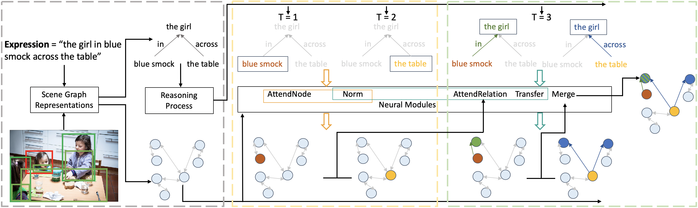

# Graph-Structured Referring Expressions Reasoning in The Wild
This repository contains the data and code for the following paper:

* Yang, S., Li, G., & Yu, Y. *Graph-Structured Referring Expressions Reasoning in The Wild*. In CVPR 2020, Oral. ([PDF](https://drive.google.com/file/d/1yogm2d5l49clAN3Hf4yZ5LMvi25WON8h/view)) 




## Other Baselines
1. Train and evaluate on [CMRIN](https://github.com/sibeiyang/sgmn/tree/master/lib/cmrin_models). 
   * Yang, S., Li, G., & Yu, Y. *Cross-Modal Relationship Inference for Grounding Referring Expressions*. In CVPR, 2019. ([PDF](http://openaccess.thecvf.com/content_CVPR_2019/papers/Yang_Cross-Modal_Relationship_Inference_for_Grounding_Referring_Expressions_CVPR_2019_paper.pdf)) 
   * Yang, S., Li, G., & Yu, Y. *Relationship-Embedded Representation Learning for Grounding Referring Expressions*. In TPAMI, 2020. ([PDF](https://arxiv.org/pdf/1906.04464.pdf)) 
2. Train and evaluate on [DGA](https://github.com/sibeiyang/sgmn/tree/master/lib/dga_models). 
   * Yang, S., Li, G., & Yu, Y. *Dynamic Graph Attention for Referring Expression Comprehension*. In ICCV, 2019, Oral. ([PDF](http://openaccess.thecvf.com/content_ICCV_2019/papers/Yang_Dynamic_Graph_Attention_for_Referring_Expression_Comprehension_ICCV_2019_paper.pdf))

## Installation
1. Install Python 2.7 ([Anaconda](https://www.anaconda.com/distribution/)).
2. Install PyTorch 0.4.0 and TorchVision.
4. Install other dependency packages.
3. Clone this repository and enter the root directory of it.
   ```
   git clone https://github.com/sibeiyang/sgmn.git && cd sgmn
   ```

## [Ref-Reasoning Dataset](https://sibeiyang.github.io/dataset/ref-reasoning)
Ref-Reasoning is a large-scale real-word dataset for referring expressions reasoning, 
which contains 791,956 referring expressions in 83,989 images. It includes semantically rich expressions describing objects, attributes, direct relations and indirect relations with different reasoning layouts. 


### Images and Objects 
Ref-Reasoning is built on the scenes from the [GQA dataset](https://cs.stanford.edu/people/dorarad/gqa/about.html) and share the same [training images](https://nlp.stanford.edu/data/gqa/allImages.zip) with GQA. 
We generate referring expressions according to the [image scene graph annotations](https://nlp.stanford.edu/data/gqa/sceneGraphs.zip) provided by the [Visual Genome dataset]() and further normalized by the GQA dataset.
In oder to use the scene graphs for referring expression generation, we remove some unnatural edges and classes, e.g., "nose left of eyes". 
In addition, we add edges between objects to represent same-attribute relations between objects, i.e., "same material", "same color" and "same shape''. 
In total, there are 1,664 object classes, 308 relation classes and 610 attribute classes in the adopted scene graphs.

We provide the info and extracted visual features ([bottom-up features](https://github.com/peteanderson80/bottom-up-attention)) from Faster R-CNN for ground-truth objects in the images. 
The [gt_objects](https://drive.google.com/drive/folders/10woLRXMEHuiqyMrikRGMiBGNqRqo81HH?usp=sharing) contains:
    
  * The `gt_objects_info.json` is a dictionary from each image id to the info about the image and the image's index in the h5 file.
  * The `gt_objects_*.h5` includes objects' visual features and bounding boxes in pixels.

### Expressions and Referents
Ref-Reasoning has 721,164, 36,183 and 34,609 expression-referent pairs for training, validation and testing, respectively. 
In order to generate referring expressions with diverse reasoning layouts,
for each specified number of nodes, we design a family of referring expression templates for each reasoning layout.
We generate expressions according to layouts and templates using functional programs, 
and the functional program for each template can be easily obtained according to the layout. 

In [Ref-Reasoning](https://drive.google.com/drive/folders/1w4qhQgrgUeGOr_wG5KP0yUouMzRNBAxo?usp=sharing),
  * The `*_expressions.json` is a dictionary from each expression id to the info about the expression and its referent, 
  including image id, referent id, referent's bounding box in pixel, expression and the number of objects described by the expression.
  
## Training and Evaluation

Coming soon.


## Citation
If you find the work useful in your research, please consider citing:

```
@inproceedings{yang2020graph-structured,
  title={Graph-Structured Referring Expressions Reasoning in The Wild},
  author={Yang, Sibei and Li, Guanbin and Yu, Yizhou},
  journal={Proceedings of the IEEE Conference on Computer Vision and Pattern Recognition},
  year={2020}
}
```

## Acknowlegement
Part of code obtained from [MattNet](https://github.com/lichengunc/MAttNet) codebase.

## Contact
sbyang [at] cs.hku.hk