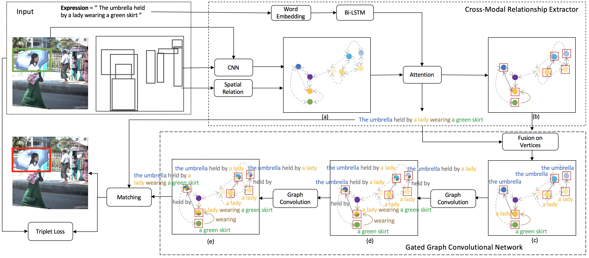

# Cross-Modal Relationship Inference for Grounding Referring Expressions
This repository contains the CMRIN for the following paper:

* Yang, S., Li, G., & Yu, Y. *Cross-Modal Relationship Inference for Grounding Referring Expressions*. In CVPR 2019. ([PDF](http://openaccess.thecvf.com/content_CVPR_2019/papers/Yang_Cross-Modal_Relationship_Inference_for_Grounding_Referring_Expressions_CVPR_2019_paper.pdf)) 



## Installation
1. Install Python 2.7 ([Anaconda](https://www.anaconda.com/distribution/)).
2. Install PyTorch 0.4.0 and TorchVision.
4. Install other dependency packages.
3. Clone this repository and enter the root directory of it.
   ```
   git clone https://github.com/sibeiyang/sgmn.git && cd sgmn
   ```

## Preparation
* Ref-Reasoning Dataset. Please refer to [Ref-Reasoning Dataset of SGMN](https://github.com/sibeiyang/sgmn/).

* RefCOCO, RefCOCO+ and RefCOCOg Datasets. 
  Inspired by the [Bottom-Up Attention](https://github.com/peteanderson80/bottom-up-attention), we train ResNet-101 based Faster R-CNN over selected 1,460 object categories in the Visual Genome dataset, 
  excluding the images in the training, validation and testing sets of RefCOCO, RefCOCO+ and RefCOCOg. 
  We combine the detected objects and the ground-truth objects provided by MSCOCO to form the final set of objects in the images. 
  We extract the visual features of objects as the 2,048-dimensional output from the pool5 layer of the ResNet-101 based Faster R-CNN model.
  
  Please download the [pretrained feature extractor](https://drive.google.com/file/d/1Pdkta71WPlAjD0RuzTCd7nAVzDo48u50/view?usp=sharing) and its corresponding [prototxt](https://drive.google.com/open?id=1TLIeIhfxP7KeYrINJata-TeGUNRhSWce), and then extract object features using [`tools/generate_tsv.py`](https://github.com/peteanderson80/bottom-up-attention/tree/master/tools).
## Training and Evaluation 
For the example of running on Ref-Reasoning dataset,
1. Download the [Ref-Reasoning dataset](https://drive.google.com/drive/folders/1w4qhQgrgUeGOr_wG5KP0yUouMzRNBAxo?usp=sharing) which includes the referring expressions and referents, and put them to `/data/refvg/`.
2. Download the [gt_objects](https://drive.google.com/drive/folders/10woLRXMEHuiqyMrikRGMiBGNqRqo81HH?usp=sharing), and symbol link it to `/data/gt_objects/`.
3. Download the [lrel_gt_objs](https://drive.google.com/open?id=1Co47UQWGHPeHeMu7u8G1HOdpuTxNIoxD), and put h5 files to `/data/gt_objects/`. The `lrel_gt_objects_*.h5` includes the spatial relationship types between objects.
4. Download the [GloVe](https://drive.google.com/drive/folders/1_rd58NV4LAGH3nZ4ABcgJzAAMkLaNsi3?usp=sharing), and symbol link it to `/data/word_embedding/`.
5. Train the model:
   ```
   bash experiments/script/train_cmrin.sh $GPUs
   ```
6. Evaluate the model:
   ```
   bash experiments/script/evaluate_cmrin.sh $GPUs $Checkpoint
   ```
   
## Citation
If you find the work useful in your research, please consider citing:

```
@inproceedings{yang2019cross-modal,
  title={Cross-Modal Relationship Inference for Grounding Referring Expressions},
  author={Yang, Sibei and Li, Guanbin and Yu, Yizhou},
  journal={Proceedings of the IEEE Conference on Computer Vision and Pattern Recognition},
  year={2019}
}
```

## Acknowlegement
Part of code obtained from [MattNet](https://github.com/lichengunc/MAttNet) codebase.

## Contact
sbyang [at] cs.hku.hk