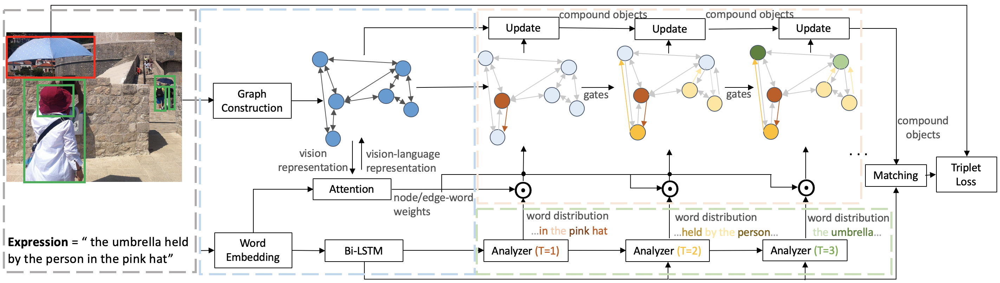

# Dynamic Graph Attention for Referring Expression Comprehension
This repository contains the DGA for the following paper:

* Yang, S., Li, G., & Yu, Y. *Dynamic Graph Attention for Referring Expression Comprehension*. In ICCV 2019, Oral. ([PDF](http://openaccess.thecvf.com/content_ICCV_2019/papers/Yang_Dynamic_Graph_Attention_for_Referring_Expression_Comprehension_ICCV_2019_paper.pdf)) 



## Installation
1. Install Python 2.7 ([Anaconda](https://www.anaconda.com/distribution/)).
2. Install PyTorch 0.4.0 and TorchVision.
4. Install other dependency packages.
3. Clone this repository and enter the root directory of it.
   ```
   git clone https://github.com/sibeiyang/sgmn.git && cd sgmn
   ```

## Preparation
* Ref-Reasoning Dataset. Please refer to [Ref-Reasoning Dataset of SGMN](https://github.com/sibeiyang/sgmn/).

* RefCOCO, RefCOCO+ and RefCOCOg Datasets. Please refer to [Preparation of CMRIN](https://github.com/sibeiyang/sgmn/tree/master/lib/cmrin_models).

## Training and Evaluation 
For the example of running on Ref-Reasoning dataset,
1. Download the [Ref-Reasoning dataset](https://drive.google.com/drive/folders/1w4qhQgrgUeGOr_wG5KP0yUouMzRNBAxo?usp=sharing) which includes the referring expressions and referents, and put them to `/data/refvg/`.
2. Download the [gt_objects](https://drive.google.com/drive/folders/10woLRXMEHuiqyMrikRGMiBGNqRqo81HH?usp=sharing), and symbol link it to `/data/gt_objects/`.
3. Download the [lrel_gt_objs](https://drive.google.com/open?id=1Co47UQWGHPeHeMu7u8G1HOdpuTxNIoxD), and put h5 files to `/data/gt_objects/`. The `lrel_gt_objects_*.h5` includes the spatial relationship types between objects.
4. Download the [GloVe](https://drive.google.com/drive/folders/1_rd58NV4LAGH3nZ4ABcgJzAAMkLaNsi3?usp=sharing), and symbol link it to `/data/word_embedding/`.
5. Train the model:
   ```
   bash experiments/script/train_dga.sh $GPUs
   ```
6. Evaluate the model:
   ```
   bash experiments/script/evaluate_dga.sh $GPUs $Checkpoint
   ```
   
## Citation
If you find the work useful in your research, please consider citing:

```
@inproceedings{yang2019dynamic,
  title={Dynamic Graph Attention for Referring Expression Comprehension},
  author={Yang, Sibei and Li, Guanbin and Yu, Yizhou},
  journal={Proceedings of the IEEE International Conference on Computer Vision},
  year={2019}
}
```

## Acknowlegement
Part of code obtained from [MattNet](https://github.com/lichengunc/MAttNet) and [MAC](https://github.com/stanfordnlp/mac-network) codebases.

## Contact
sbyang [at] cs.hku.hk